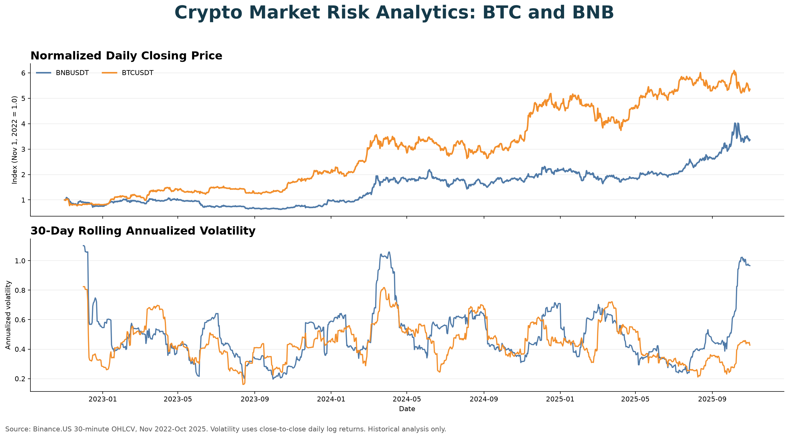

# Crypto Market Risk Analytics

English | [简体中文](README.zh-CN.md)

An end-to-end financial risk analytics project for BTC/USDT and BNB/USDT market data. The project combines market-risk analysis with a reproducible data pipeline: it collects 30-minute OHLCV candles from Binance.US, stores analytical files in Parquet, loads a MySQL star schema, evaluates returns and volatility in Python, and presents decision-oriented insights in Tableau.

> Educational portfolio project. The analysis is not investment advice.



## Project scope

- **Assets:** BTC/USDT and BNB/USDT
- **Granularity:** 30-minute candles with daily aggregations
- **Included dataset:** November 1, 2022 to October 31, 2025 (52,594 rows per asset)
- **Analysis:** price and volume trends, rolling volatility, return distributions, and monthly, seasonal, and weekday risk-return patterns
- **Pipeline:** Binance.US API → Parquet → MySQL → Python/Tableau

## Repository structure

```text
.
├── data/processed/          # Included BTC and BNB Parquet datasets
├── docs/                    # Dashboard, architecture, schema, and presentation
├── notebooks/               # Exploratory data analysis
├── sql/                     # Warehouse schema and daily aggregation
├── src/                     # Data collection and MySQL ingestion scripts
├── tableau/                 # Tableau workbook
├── .env.example             # Database configuration template
└── requirements.txt         # Python dependencies
```

## Architecture


The warehouse separates 30-minute observations from daily summaries. Date, datetime, symbol, and season dimensions support reusable time-based analysis.

## Key findings

- BTC grew more over the sample period: its normalized closing price increased to 5.36 times its starting value, compared with 3.36 times for BNB.
- BNB had higher close-to-close daily volatility than BTC (2.83% versus 2.47%), so absolute price levels should not be used to compare risk across assets.
- Average intraday returns were negative for both assets in summer. BTC's average daily range was highest in summer, while BNB's was highest in winter.
- Wednesday had the highest average intraday return for both assets, but this historical pattern does not imply future performance.

### Metric definitions

- **Close-to-close return:** log change between consecutive daily closing prices.
- **Close-to-close volatility:** standard deviation of daily log returns.
- **Intraday return:** `(daily close - daily open) / daily open`.
- **Daily range:** `(daily high - daily low) / daily open`.

The Tableau seasonal views use intraday return and daily range. The Python notebook uses close-to-close log returns and rolling volatility. Keeping the definitions separate prevents price-level differences from being mistaken for risk.

## Quick start

### 1. Install Python dependencies

```bash
python -m venv .venv
source .venv/bin/activate
pip install -r requirements.txt
```

### 2. Configure MySQL

The SQL scripts require MySQL 8.0 or later because the daily aggregation uses window functions.

```bash
cp .env.example .env
```

Edit `.env`, then create the database and tables:

```bash
mysql -u root -p < sql/schema.sql
```

### 3. Use the included data or fetch it again

The repository includes the two Parquet files used in the project. To refresh the market data:

```bash
python src/fetch_market_data.py
```

The public candlestick endpoint and its parameters are documented in the [Binance.US API documentation](https://docs.binance.us/).

### 4. Load MySQL and build daily aggregates

```bash
python src/ingest_to_mysql.py
mysql -u root -p crypto_db < sql/daily_aggregation.sql
```

### 5. Explore the analysis

- Run `python src/validate_data.py` to reproduce the data-quality checks.
- Open `notebooks/crypto_market_eda.ipynb` in Jupyter. The committed notebook includes outputs so the analysis is also visible on GitHub.
- Open `tableau/crypto_market_dashboard.twb` in Tableau Desktop and update the MySQL connection if needed. Tableau's [MySQL connector guide](https://help.tableau.com/current/pro/desktop/en-us/examples_mysql.htm) lists the required connection information and driver.
- Open `docs/project_presentation.pptx` for the full project narrative and findings.

## Data quality and limitations

- Both assets contain one identical source-data gap on February 6, 2023: 14 expected 30-minute candles are absent between 04:30 and 12:00 UTC.
- The datasets contain no duplicate symbol/timestamp pairs, null required fields, negative market values, or invalid OHLC relationships.
- Results describe the included Binance.US sample and should not be interpreted as forecasts or investment recommendations.
- The Tableau workbook uses a local MySQL connection. The risk overview above lets reviewers inspect the core findings without database setup.

## Team

CryptoKoi

- Jiayi Yao — Risk Analyst
- Qi Hu — Data Analyst
- Yue Shen — Data Engineer
- Connor Yeh — Data Engineer
- Kacey Zhu — Project Manager

### My contribution

As the Risk Analyst, Jiayi Yao defined the return and volatility measures, compared BTC and BNB across monthly, seasonal, and weekday patterns, checked whether conclusions were supported by the data, and translated the findings into portfolio-ready risk insights and recommendations.

## Data and technical references

- [Binance.US API documentation](https://docs.binance.us/)
- [MySQL generated columns](https://dev.mysql.com/doc/refman/8.0/en/create-table-generated-columns.html)
- [Apache Parquet](https://parquet.apache.org/)
- [Tableau MySQL connector](https://help.tableau.com/current/pro/desktop/en-us/examples_mysql.htm)
