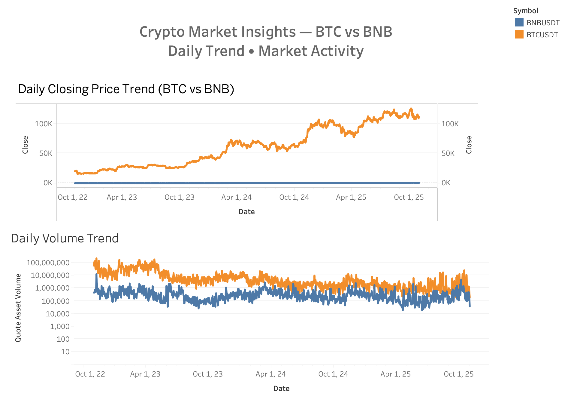
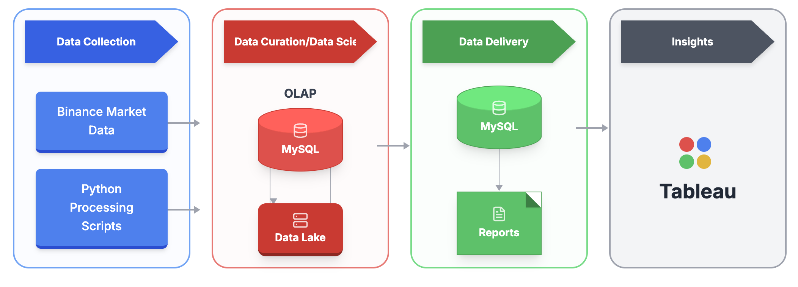
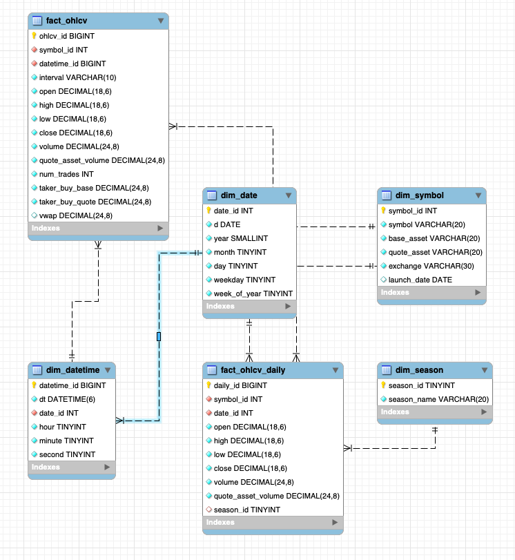

# Crypto Market Risk Analytics

English | [简体中文](README.zh-CN.md)

An end-to-end financial risk analytics project for BTC/USDT and BNB/USDT market data. The project combines market-risk analysis with a reproducible data pipeline: it collects 30-minute OHLCV candles from Binance.US, stores analytical files in Parquet, loads a MySQL star schema, evaluates returns and volatility in Python, and presents decision-oriented insights in Tableau.

> Educational portfolio project. The analysis is not investment advice.



## Project scope

- **Assets:** BTC/USDT and BNB/USDT
- **Granularity:** 30-minute candles with daily aggregations
- **Included dataset:** November 2022 to October 2025
- **Analysis:** price and volume trends, rolling volatility, return distributions, and monthly, seasonal, and weekday risk-return patterns
- **Pipeline:** Binance.US API → Parquet → MySQL → Python/Tableau

## Repository structure

```text
.
├── data/processed/          # Included BTC and BNB Parquet datasets
├── docs/                    # Dashboard, architecture, schema, and presentation
├── notebooks/               # Exploratory data analysis
├── sql/                     # Warehouse schema and daily aggregation
├── src/                     # Data collection and MySQL ingestion scripts
├── tableau/                 # Tableau workbook
├── .env.example             # Database configuration template
└── requirements.txt         # Python dependencies
```

## Architecture





The warehouse separates 30-minute observations from daily summaries. Date, datetime, symbol, and season dimensions support reusable time-based analysis.

## Quick start

### 1. Install Python dependencies

```bash
python -m venv .venv
source .venv/bin/activate
pip install -r requirements.txt
```

### 2. Configure MySQL

```bash
cp .env.example .env
```

Edit `.env`, then create the database and tables:

```bash
mysql -u root -p < sql/schema.sql
```

### 3. Use the included data or fetch it again

The repository includes the two Parquet files used in the project. To refresh the market data:

```bash
python src/fetch_market_data.py
```

The public candlestick endpoint and its parameters are documented in the [Binance.US API documentation](https://docs.binance.us/).

### 4. Load MySQL and build daily aggregates

```bash
python src/ingest_to_mysql.py
mysql -u root -p crypto_db < sql/daily_aggregation.sql
```

### 5. Explore the analysis

- Open `notebooks/crypto_market_eda.ipynb` in Jupyter.
- Open `tableau/crypto_market_dashboard.twb` in Tableau Desktop and update the MySQL connection if needed. Tableau's [MySQL connector guide](https://help.tableau.com/current/pro/desktop/en-us/examples_mysql.htm) lists the required connection information and driver.
- Open `docs/project_presentation.pptx` for the full project narrative and findings.

## Team

CryptoKoi

- Jiayi Yao — Risk Analyst
- Qi Hu — Data Analyst
- Yue Shen — Data Engineer
- Connor Yeh — Data Engineer
- Kacey Zhu — Project Manager

## Data and technical references

- [Binance.US API documentation](https://docs.binance.us/)
- [MySQL generated columns](https://dev.mysql.com/doc/refman/8.0/en/create-table-generated-columns.html)
- [Apache Parquet](https://parquet.apache.org/)
- [Tableau MySQL connector](https://help.tableau.com/current/pro/desktop/en-us/examples_mysql.htm)
